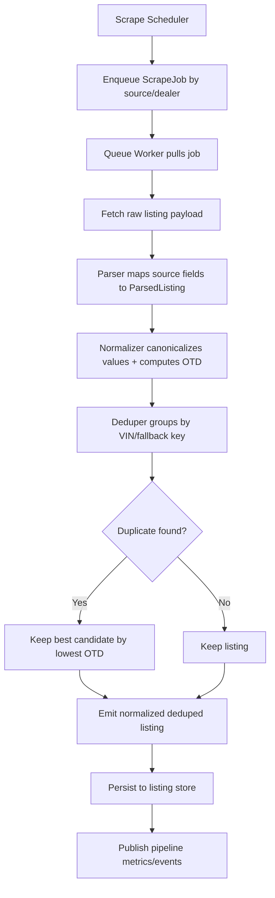

# Scraper Pipeline Flowchart

```mermaid
flowchart TD
  A[Scrape Scheduler] --> B[Enqueue ScrapeJob by source/dealer]
  B --> C[Queue Worker pulls job]
  C --> D[Fetch raw listing payload]
  D --> E[Parser maps source fields to ParsedListing]
  E --> F[Normalizer canonicalizes values + computes OTD]
  F --> G[Deduper groups by VIN/fallback key]
  G --> H{Duplicate found?}
  H -->|Yes| I[Keep best candidate by lowest OTD]
  H -->|No| J[Keep listing]
  I --> K[Emit normalized deduped listing]
  J --> K
  K --> L[Persist to listing store]
  L --> M[Publish pipeline metrics/events]
```
