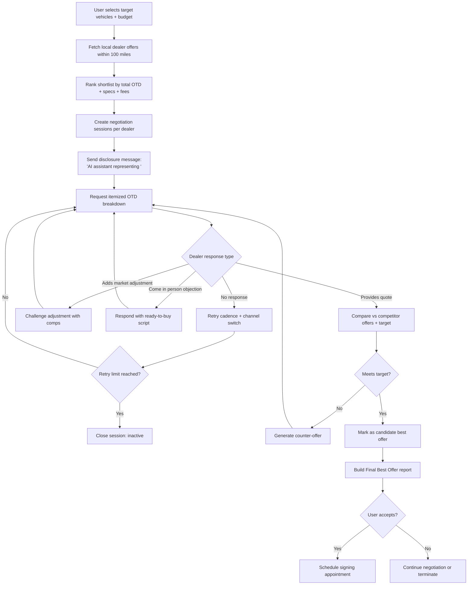

```mermaid
flowchart TD
  A[User selects target vehicles + budget] --> B[Fetch local dealer offers within 100 miles]
  B --> C[Rank shortlist by total OTD + specs + fees]
  C --> D[Create negotiation sessions per dealer]
  D --> E[Send disclosure message:\n'AI assistant representing <User>']
  E --> F[Request itemized OTD breakdown]
  F --> G{Dealer response type}
  G -->|Provides quote| H[Compare vs competitor offers + target]
  G -->|Adds market adjustment| I[Challenge adjustment with comps]
  G -->|Come in person objection| J[Respond with ready-to-buy script]
  G -->|No response| K[Retry cadence + channel switch]
  H --> L{Meets target?}
  I --> F
  J --> F
  K --> M{Retry limit reached?}
  M -->|No| F
  M -->|Yes| N[Close session: inactive]
  L -->|No| O[Generate counter-offer]
  O --> F
  L -->|Yes| P[Mark as candidate best offer]
  P --> Q[Build Final Best Offer report]
  Q --> R{User accepts?}
  R -->|Yes| S[Schedule signing appointment]
  R -->|No| T[Continue negotiation or terminate]

```

See also: `docs/flowcharts/scraper-pipeline-flowchart.md` for the scraper ingestion pipeline.
